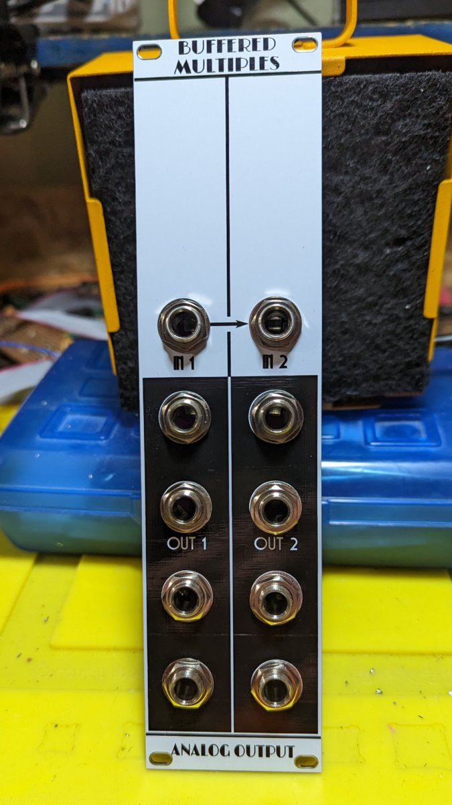

# Multiples

This is a buffered multiple module in Kosmo format. It provides two buffered multiple circuits each with one input and four outputs; the input to the second is normalized to the input of the first, so it can function as a 1-in, 8-out multiple.

It is intended to be V/oct-safe. Voltage follower stages are used to guarantee unity gain. Input impedance is 1M instead of the common 100k, resulting in attenuation (of a signal from a source with 1k output impedance) by 0.1% rather than 1% — corresponding to 1.2 cents per octave instead of 12. Output current limiting resistors are in the loop, so there will be no attenuation at the downstream input.

Two things to watch out for:

* There are no stabilization capacitors in the design. With the in-the-loop resistor, the potential exists for op amp instability when driving a capacitive load. In practice this probably means don't use 20 meter long patch cords on the outputs. In more normal usage there is not likely to be a problem.
* Use of JFET op amps (TL074) in voltage followers rather than paired inverting stages means there can be phase reversal if the input signal is less than 4 V from the negative rail, giving incorrect outputs. If your inputs might go more negative than -8 V, use a different multiple. There also is no protection against overvoltage outside the ±12 V range, so exercise care not to connect anything that might give such large voltages.

## Current draw
?? mA +12 V, ?? mA -12 V

## Photos

## Documentation

* [Schematic](Docs/multiples_schematic.pdf)
* PCB layout: [front](Docs/2D/multiples/multiples_front.svg), [back](Docs/2D/multiples/multiples_back.svg)
* [BOM](Docs/BOM/multiples_bom.md)
* [Blog post](https://analogoutputblog.wordpress.com/2023/03/13/buffered-multiples-again/)

## GitHub repository

* [https://github.com/holmesrichards/mults](https://github.com/holmesrichards/mults)
